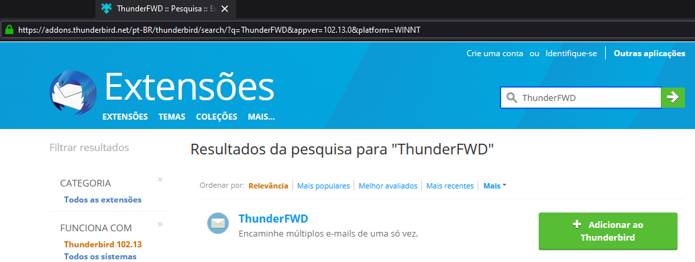
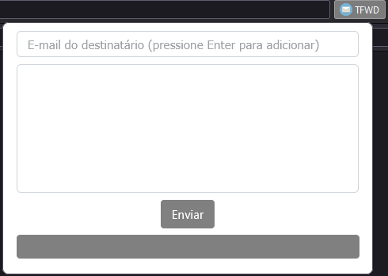
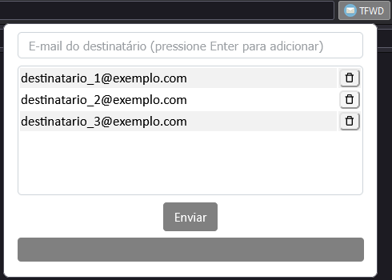
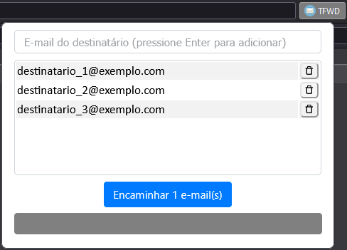
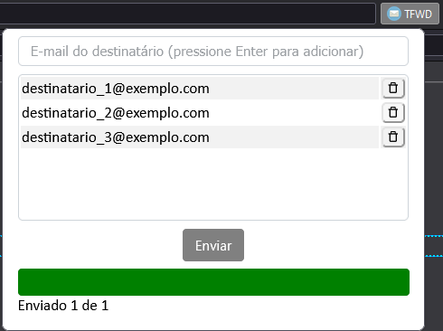

# ThunderFWD

[](https://choosealicense.com/licenses/mit/)
[]([https://choosealicense.com/licenses/mit/](https://www.thunderbird.net/pt-BR/))

O **ThunderFWD** é uma extensão para o Thunderbird que permite o encaminhamento de vários e-mails de uma só vez.
A extensão é compatível com o Thunderbird versão 102.

## Instalação
Para instalar a extensão **ThunderFWD** siga os passos abaixo:

1. Abra o Thunderbird e vá em Ferramentas > Extensões e Temas.
2. Pesquise por **ThunderFWD** e pressione Enter
3. Uma nova aba irá de abrir com a galeria oficial do Thunderbird
4. Clique em "Adicionar ao Thunderbird"   
    

## Instalação Manual
Para instalar a extensão **ThunderFWD** manualmente, siga os passos abaixo:

1. Faça o download da última versão da extensão na [galeria oficial de extensões](https://addons.thunderbird.net/en-US/thunderbird/addon/thunderfwd/) ou no [repositório do GitHub](https://github.com/viniciusccosta/ThunderFWD/releases/download/v0.1.0/thunderfwd-0.1.0.zip).
2. Abra o Thunderbird e vá em Ferramentas > Extensões e Temas.
3. Clique no ícone de engrenagem e selecione "Instalar de um arquivo"
4. Escolha o arquivo da extensão baixado e clique em Abrir.
5. O Thunderbird irá instalar a extensão. Em alguns casos, pode ser necessário reiniciar o aplicativo para que as alterações tenham efeito.

## Utilização
Após instalar a extensão **ThunderFWD**, um novo botão com o nome "TFWD" irá aparecer na barra de ferramentas, no canto direito do aplicativo.

1. Selecione os e-mails que deseja encaminhar.
2. Clique no botão "TFWD" para abrir um pequeno popup logo abaixo do botão.
3. Adicione os endereços de e-mail dos destinatários no campo de entrada.
4. Pressione a tecla Enter para adicionar cada destinatário à lista.
5. Para remover um destinatário, clique no pequeno ícone/botão ao lado direito do endereço de e-mail dele.
6. Quando tiver adicionado todos os destinatários desejados, clique no botão "Encaminhar X email(s)".
7. Para acompanhar o progresso do encaminhamento, clique novamente no botão "TFWD".

## Informações Adicionais:
1. Os endereços de e-mail dos destinatários são salvos no armazenamento local, o que facilita futuros encaminhamentos em massa sem a necessidade de digitar novamente os destinatários.
2. Endereços de e-mail dos destinatários inválidos ou duplicados serão rejeitados.
2. Durante o processo de encaminhamento, várias janelas de "Composição de E-mail" serão abertas e minimizadas em seguida. Infelizmente, não é possível encaminhar os e-mails de forma oculta sem abrir uma janela para cada e-mail.
3. A barra de progresso, localizada abaixo do botão "Iniciar Encaminhamento", irá exibir as informações sobre o último encaminhamento em massa.

## Screenshots





## Contribuições
Contribuições são bem-vindas! Se você deseja contribuir para o projeto, siga as etapas abaixo:

- Faça um fork do repositório.
- Crie uma branch para a sua feature
  ``` bash
  git checkout -b minha-feature
  ```
- Implemente suas alterações.
- Faça o commit das suas alterações
  ```bash
  git commit -am 'Adiciona minha feature'
  ````
- Envie a sua branch para o repositório remoto
  ```bash
  git push origin minha-feature
  ```
- Abra um pull request.

## Licença
Este projeto está licenciado sob a Licença MIT. Para mais informações, consulte o arquivo LICENSE.
